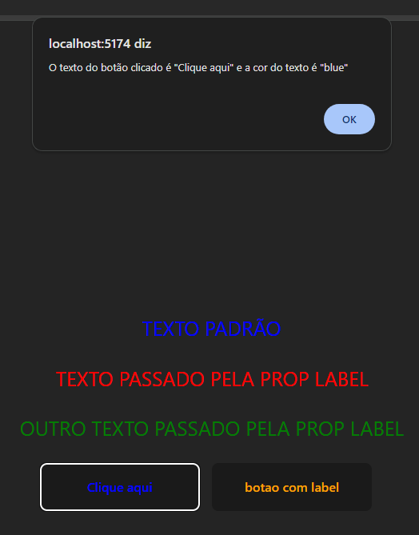

# Desafio com React base

## Sobre o desafio: 

No módulo React Base do curso DevQuest aprendi os conceitos incias do React, criação de componentes de função e de classe, props, PropTypes, defaultProps, listas e eventos no React.
Com esses conhecimentos foi possível realizar os dois desafios propostos. 

## Desafio 1: criar um componente que retorna um parágrafo em uppercase e com uma cor
Para esse desaio, foi criado um componente paragraph que recebia um valor padrão "Texto padrão" e uma prop label que substituiria o valor padrão caso seja passada. Também recebeu uma prop style de cor para o texto

```
const Paragraph = ({label, color}) => <p className="text uppercase" style={{color: color}}>{label}</p>

Paragraph.defaultProps = {
    color: 'blue',
    label: 'Texto padrão',
} 
```
## Desafio 2: criar um componente botão que ao receber um clique mostrasse um alerta na tela mostrando o texto: "O texto do botão é '(texto do botao)'":

Para esse desaio, foi criado um componente button que recebia um valor padrão de label "Clique aqui" que poderia ser substituida caso seja passado outro valor para o label. Também recebeu uma prop style de cor para o texto.

```
const showButtonProps = (label, color) => alert(`O texto do botão clicado é "${label}" e a cor do texto é "${color}"`)

const Button = ({label, color}) => <button className='button' style={{color: color}} onClick={() => showButtonProps(label, color)}>{label}</button>

Button.defaultProps = {
    label: 'Clique aqui',
    color: 'blue'
}
```

## Reenderização na tela:



## Conclusão do desafio

Com os conteúdos passados e os desafios, foi possível entender a importância do uso do React nos projetos. Uma biblioteca que facilita o trabalho, deixa o código mais clean e facilita criações de códigos HTML em  JS.

## Tecnologia Utilizadas:

<div style="display: inline_block"><br>
    <ul>
        <li>HTML 5
        
        </li>
        <br>
        <li>CSS 3
        
        </li>
        <br>
        <li>JavaScript
        
        </li>
        <br>
        <li>React
        
        </li>
    </ul>
</div>